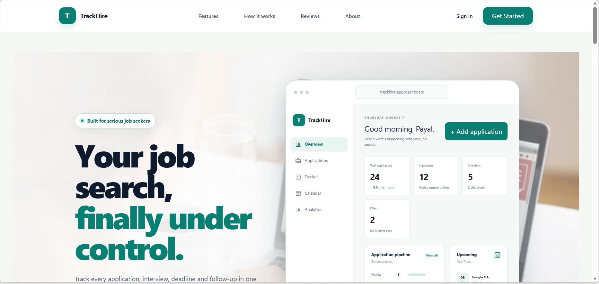
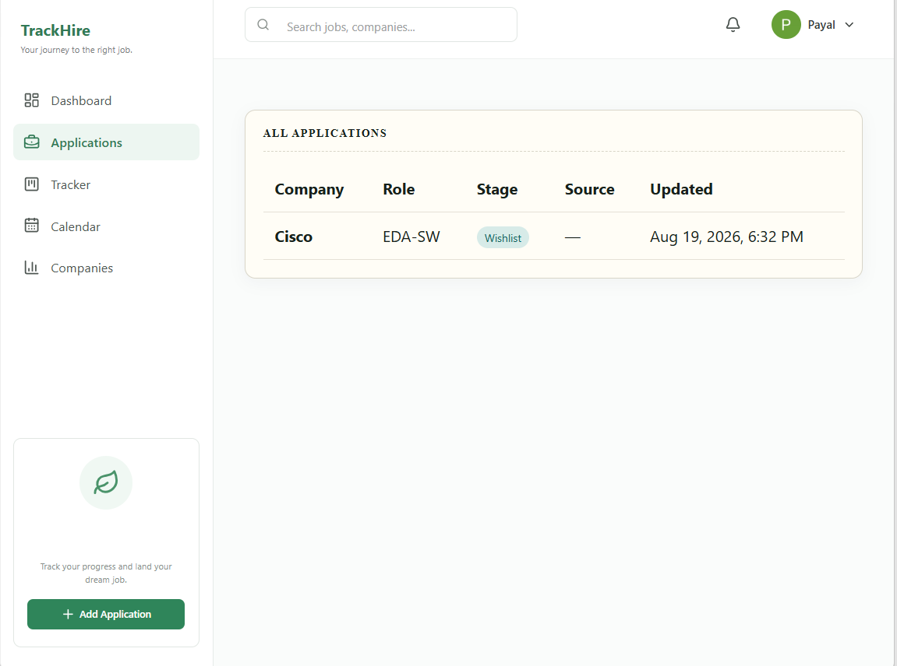
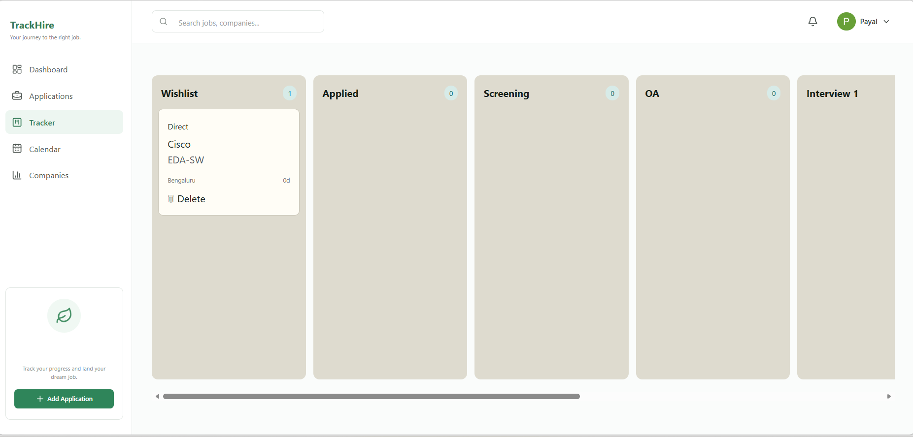
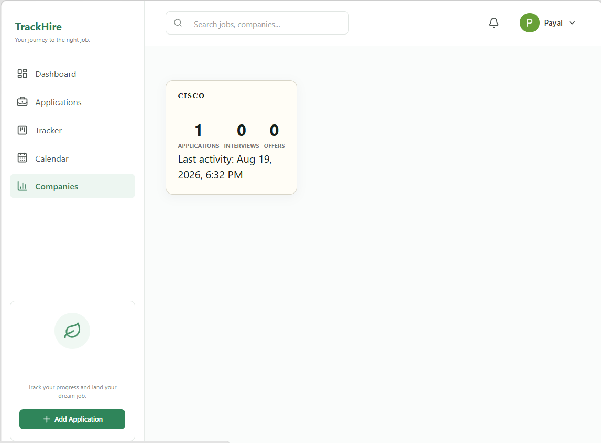

# 🚀 TrackHire

### Your smarter, cleaner, and more organized job application tracker.

<p align="center">
  
</p>

<p align="center">
  <strong>Track every application. Never miss a deadline. Stay interview-ready.</strong>
</p>

<p align="center">
  <a href="YOUR_LIVE_DEMO_URL">🌐 Live Demo</a>
  •
  <a href="https://github.com/Payal12-max">💻 GitHub</a>
  •
  <a href="#-features">✨ Features</a>
  •
  <a href="#-installation">⚙️ Setup</a>
</p>

---

## ✨ Why TrackHire?

Job hunting gets messy fast.

Applications are scattered across job portals, spreadsheets, emails, notes and bookmarks.

**TrackHire brings everything into one place.**

```text
        🔎 Discover
             ↓
       📝 Apply
             ↓
      📊 Track Progress
             ↓
      🎯 Prepare Better
             ↓
       🎉 Get Hired
````

---

# 🖼️ Product Preview

### 🏠 Dashboard

<p align="center">
  
</p>

<br>

### 📋 Application Tracker

<p align="center">
  
</p>

<br>

### 🎤 Interview Tracker

<p align="center">
  
</p>

<br>

### 🤖 AI Insights

<p align="center">
  
</p>

---

# 🌟 Features

<table>
<tr>
<td width="50%">

### 📌 Application Management

* Create and edit applications
* Kanban-style application stages
* Application history
* Job description storage
* Salary & location tracking
* Application source tracking

</td>

<td width="50%">

### ⏰ Smart Reminders

* Follow-up reminders
* Upcoming deadlines
* Overdue actions
* Completion tracking
* Application-specific reminders

</td>
</tr>

<tr>
<td>

### 🎤 Interview Management

* Schedule interviews
* Track interview rounds
* Record performance
* Add reflections
* Store interview questions
* Track difficulty & solved status

</td>

<td>

### 🤖 AI-Powered Insights

* Job description analysis
* Required skill extraction
* Resume ↔ JD matching
* Skill gap detection
* Actionable recommendations

</td>
</tr>

<tr>
<td>

### 📊 Analytics Dashboard

* Applications by stage
* Application conversion rate
* Offers & rejections
* Monthly application trends
* Application sources
* Reminder analytics

</td>

<td>

### 🔐 Secure Authentication

* Clerk authentication
* User-specific application data
* Protected API routes
* Ownership verification
* Secure backend access

</td>
</tr>
</table>

---

# 🧭 Application Pipeline

Track every opportunity through its journey:

```text
┌───────────┐
│ Wishlist  │
└─────┬─────┘
      ↓
┌───────────┐
│  Applied  │
└─────┬─────┘
      ↓
┌───────────┐
│ Screening │
└─────┬─────┘
      ↓
┌───────────┐
│    OA     │
└─────┬─────┘
      ↓
┌───────────┐
│ Interview │
│    R1     │
└─────┬─────┘
      ↓
┌───────────┐
│ Interview │
│    R2     │
└─────┬─────┘
      ↓
   ┌──┴───┐
   ↓      ↓
┌──────┐ ┌──────────┐
│ Offer│ │ Rejected │
└──────┘ └──────────┘
```

---

# 🛠️ Tech Stack

### Frontend

<p>
  
</p>

* React
* Vite
* Tailwind CSS
* JavaScript
* Responsive UI

### Backend

<p>
  
</p>

* Node.js
* Express.js
* Prisma ORM
* REST APIs

### Database

<p>
  
</p>

* PostgreSQL
* Neon PostgreSQL

### Authentication

* Clerk

### Development

<p>
  
</p>

* Git
* GitHub
* VS Code

---

# 🏗️ Architecture

```text
                    ┌─────────────────────┐
                    │      TrackHire      │
                    │     React Client    │
                    └──────────┬──────────┘
                               │
                               │ REST API
                               ↓
                    ┌─────────────────────┐
                    │    Express Server   │
                    │      Node.js        │
                    └──────────┬──────────┘
                               │
                ┌──────────────┼──────────────┐
                ↓              ↓              ↓
        ┌─────────────┐ ┌────────────┐ ┌─────────────┐
        │    Clerk    │ │   Prisma   │ │ AI Analysis │
        │    Auth     │ │    ORM     │ │   Engine    │
        └─────────────┘ └─────┬──────┘ └─────────────┘
                              │
                              ↓
                     ┌────────────────┐
                     │ PostgreSQL DB  │
                     │     Neon       │
                     └────────────────┘
```

---

# 📁 Project Structure

```text
TrackHire/
│
├── frontend/
│   ├── src/
│   │   ├── components/
│   │   ├── pages/
│   │   ├── hooks/
│   │   ├── services/
│   │   └── ...
│   │
│   ├── public/
│   └── package.json
│
├── backend/
│   ├── routes/
│   │   ├── applications.js
│   │   ├── reminders.js
│   │   ├── interviews.js
│   │   ├── companies.js
│   │   ├── stats.js
│   │   └── ai.js
│   │
│   ├── scripts/
│   ├── src/
│   │   └── lib/
│   │       └── prisma.js
│   │
│   ├── prisma/
│   ├── server.js
│   └── package.json
│
├── screenshots/
│   ├── dashboard.png
│   ├── applications.png
│   ├── interviews.png
│   └── ai.png
│
└── README.md
```

---

# ⚙️ Installation

## 1. Clone the repository

```bash
git clone YOUR_GITHUB_REPOSITORY_URL
cd TrackHire
```

---

## 2. Install dependencies

### Frontend

```bash
cd frontend
npm install
```

### Backend

```bash
cd ../backend
npm install
```

---

# 🔑 Environment Variables

Create a `.env` file inside the backend directory:

```env
DATABASE_URL="YOUR_NEON_DATABASE_URL"

CLERK_SECRET_KEY="YOUR_CLERK_SECRET_KEY"

PORT=3000
```

Create a `.env` file inside the frontend directory:

```env
VITE_API_URL="YOUR_BACKEND_URL"

VITE_CLERK_PUBLISHABLE_KEY="YOUR_CLERK_PUBLISHABLE_KEY"
```

> ⚠️ Never commit `.env` files or secret keys to GitHub.

---

# 🗄️ Database Setup

Run Prisma migrations:

```bash
npx prisma migrate dev
```

Generate Prisma Client:

```bash
npx prisma generate
```

Optional: seed the database.

```bash
node scripts/seed.js
```

---

# ▶️ Running Locally

### Start Backend

```bash
cd backend
npm run dev
```

Backend:

```text
http://localhost:3000
```

### Start Frontend

Open another terminal:

```bash
cd frontend
npm run dev
```

Frontend:

```text
http://localhost:5173
```

---

# 🔌 API Overview

| Method   | Endpoint                      | Purpose                 |
| -------- | ----------------------------- | ----------------------- |
| `GET`    | `/api/applications`           | Get applications        |
| `POST`   | `/api/applications`           | Create application      |
| `PATCH`  | `/api/applications/:id`       | Update application      |
| `PATCH`  | `/api/applications/:id/stage` | Move application        |
| `DELETE` | `/api/applications/:id`       | Delete application      |
| `GET`    | `/api/reminders`              | Get reminders           |
| `POST`   | `/api/reminders`              | Create reminder         |
| `PATCH`  | `/api/reminders/:id`          | Update reminder         |
| `DELETE` | `/api/reminders/:id`          | Delete reminder         |
| `GET`    | `/api/interviews`             | Get interviews          |
| `POST`   | `/api/interviews`             | Create interview        |
| `DELETE` | `/api/interviews/:id`         | Delete interview        |
| `GET`    | `/api/companies`              | Company analytics       |
| `GET`    | `/api/stats`                  | Application statistics  |
| `POST`   | `/api/ai/job-summary`         | Analyze job description |
| `POST`   | `/api/ai/resume-match`        | Match resume with JD    |
| `GET`    | `/api/ai/weekly`              | Weekly insights         |

---

# 🔐 Security

TrackHire uses **user-level ownership checks** throughout the backend.

Every protected resource verifies:

```text
Request
   ↓
Clerk Authentication
   ↓
Get userId
   ↓
Verify resource ownership
   ↓
Database operation
   ↓
Response
```

This ensures users can only access their own:

* Applications
* Interviews
* Reminders
* Analytics
* AI analyses

---

# 📊 What TrackHire Helps You Answer

Instead of wondering:

> "Where did I apply?"

TrackHire helps you see:

### 📈 Application Progress

```text
Applications       42
Interviews          8
Offers              2
Rejections          9
```

### 🎯 Skill Gaps

```text
Job Requirements
        ↓
Resume
        ↓
┌─────────────────────────┐
│ ✓ React                 │
│ ✓ JavaScript            │
│ ✓ Node.js               │
│ ✗ Docker                │
│ ✗ AWS                   │
└─────────────────────────┘
```

### ⏰ What Needs Attention

```text
🔴 Follow up with Google
🟠 Interview tomorrow
🟡 OA deadline approaching
🟢 Application updated
```

---

# 🚀 Roadmap

* [x] Application tracking
* [x] Kanban pipeline
* [x] Clerk authentication
* [x] PostgreSQL integration
* [x] Prisma ORM
* [x] Interview tracking
* [x] Reminder system
* [x] Analytics dashboard
* [x] AI job analysis
* [x] Resume matching
* [ ] Email reminders
* [ ] Job-board integrations
* [ ] Browser extension
* [ ] Advanced AI career insights
* [ ] Automated application tracking
* [ ] Mobile application

---

# 🎨 Design Philosophy

TrackHire is built around three principles:

### ⚡ Fast

Important information should be visible immediately.

### 🧠 Intelligent

Analytics and AI should turn raw application data into useful insights.

### 🎯 Focused

The interface should help you focus on **getting the next interview**, not managing spreadsheets.

---

# 🧪 Development

Run the frontend development server:

```bash
npm run dev
```

Run backend development server:

```bash
npm run dev
```

Build frontend:

```bash
npm run build
```

---

# 🤝 Contributing

Contributions are welcome!

```bash
# Fork the repository

# Create a feature branch
git checkout -b feature/amazing-feature

# Commit your changes
git commit -m "Add amazing feature"

# Push your branch
git push origin feature/amazing-feature

# Open a Pull Request
```

---

# 👩‍💻 Author

## Payal Sulaniya

**ECE-AI | Full-Stack Developer | Problem Solver**

Interested in:

```text
Web Development
     +
AI / LLMs
     +
Cloud
     +
Data Structures & Algorithms
```

<p align="center">

<a href="https://www.linkedin.com/in/payal-sulaniya-a8a566328">
  
</a>

<a href="https://github.com/Payal12-max">
  
</a>

</p>

---

# ⭐ Support

If TrackHire helped you organize your job search, consider giving the project a ⭐ on GitHub.

<p align="center">

### 🚀 Track smarter. Prepare better. Get hired.

**Built with ❤️ for the job hunt.**

</p>
